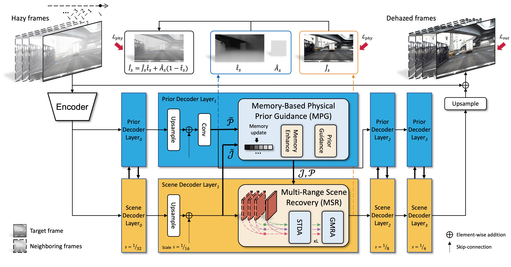
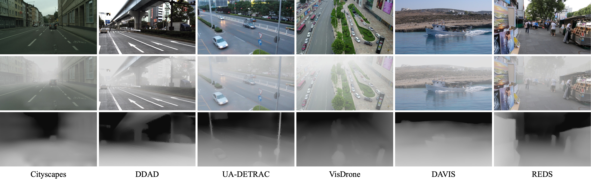

# [MAP-Net](https://arxiv.org/abs/2303.09757)

PyTorch implementation of **MAP-Net**, from the following paper:

[Video Dehazing via a Multi-Range Temporal Alignment Network with Physical Prior](https://arxiv.org/abs/2303.09757). CVPR 2023.\
Jiaqi Xu, Xiaowei Hu, Lei Zhu, Qi Dou, Jifeng Dai, Yu Qiao, and Pheng-Ann Heng

<p align="center">

</p>

We propose **MAP-Net**, a novel video dehazing framework that effectively explores the physical haze priors and aggregates temporal information.


## Dataset

<p align="center">

</p>

We construct a large-scale outdoor video dehazing benchmark dataset, **HazeWorld**, which contains video frames in various real-world scenarios.

To prepare the HazeWorld dataset for experiments, please follow the [instructions](./docs/dataset_prepare.md).


## Installation

This implementation is based on [MMEditing](https://github.com/open-mmlab/mmediting),
which is an open-source image and video editing toolbox.

```
python 3.10.9
pytorch 1.12.1
torchvision 0.13.1
cuda 11.3
```

Below are quick steps for installation.

**Step 1.**
Install PyTorch following [official instructions](https://pytorch.org/get-started/locally/).

**Step 2.**
Install MMCV with [MIM](https://github.com/open-mmlab/mim).

```shell
pip3 install openmim
mim install mmcv-full
```

**Step 3.**
Install MAP-Net from source.

```shell
git clone https://github.com/jiaqixuac/MAP-Net.git
cd MAP-Net
pip3 install -e .
```

Please refer to [MMEditing Installation](https://github.com/open-mmlab/mmediting/blob/master/docs/en/install.md) for more detailed instruction.


## Getting Started

You can train MAP-Net on HazeWorld using the below command with 4 GPUs:

```shell
bash tools/dist_train.sh configs/dehazers/mapnet/mapnet_hazeworld.py 4
```


## Evaluation

We mainly use [psnr and ssim](./mmedit/core/evaluation/metrics.py) to measure the model performance.
For HazeWorld, we compute the dataset-averaged video-level metrics;
see the [*evaluate*](./mmedit/datasets/hw_folder_multiple_gt_dataset.py) function.

You can use the following command with 1 GPU to test your trained model `xxx.pth`:

```shell
bash tools/dist_test.sh configs/dehazers/mapnet/mapnet_hazeworld.py xxx.pth 1
```

You can find one model checkpoint trained on HazeWorld [here](https://appsrv.cse.cuhk.edu.hk/~jqxu/models/mapnet_hazeworld_40k.pth).


## Results

Demo for the real-world hazy videos.

https://user-images.githubusercontent.com/33066765/224627919-cdc91886-9ab3-4b51-873b-3596c4aea085.mp4

For the [REVIDE](https://github.com/BookerDeWitt/REVIDE_Dataset) dataset,
the visual results of MAP-Net can be downloaded [here](https://appsrv.cse.cuhk.edu.hk/~jqxu/data/visual_results_MAP-Net_REVIDE.zip).


## Acknowledgement

This repository is built using the [mmedit](https://github.com/open-mmlab/mmediting/releases/tag/v1.0.0rc6)
and [mmseg](https://github.com/open-mmlab/mmsegmentation) toolboxes,
[DAT](https://github.com/LeapLabTHU/DAT)
and [STM](https://github.com/seoungwugoh/STM) repositories.


## Citation

If you find this repository helpful to your research, please consider citing the following:

```bibtex
@inproceedings{xu2023map,
  title     = {Video Dehazing via a Multi-Range Temporal Alignment Network with Physical Prior},
  author    = {Jiaqi Xu and Xiaowei Hu and Lei Zhu and Qi Dou and Jifeng Dai and Yu Qiao and Pheng-Ann Heng},
  booktitle = {Proceedings of the IEEE/CVF Conference on Computer Vision and Pattern Recognition (CVPR)},
  year      = {2023},
}
```


## License

This project is released under the [MIT license](./LICENSE).
Please refer to the acknowledged repositories for their licenses.
